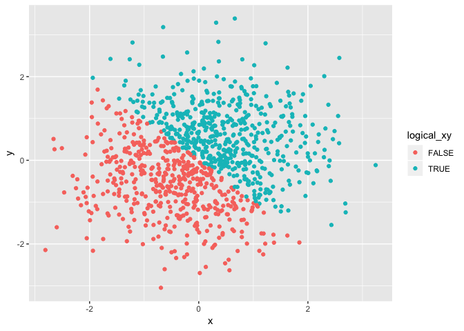
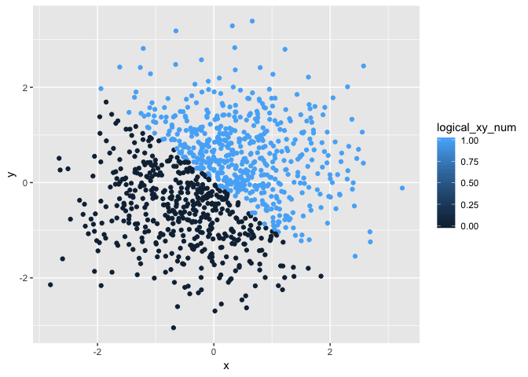
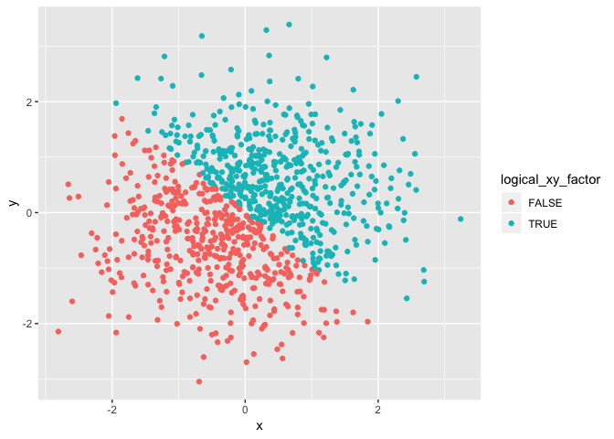

p8105\_hw1\_zf2212
================
Catherine
9/13/2018

Problem 1
=========

``` r
library(tidyverse)
```

    ## ── Attaching packages ──────────────────────────────────────────────── tidyverse 1.2.1 ──

    ## ✔ ggplot2 3.0.0     ✔ purrr   0.2.5
    ## ✔ tibble  1.4.2     ✔ dplyr   0.7.6
    ## ✔ tidyr   0.8.1     ✔ stringr 1.3.1
    ## ✔ readr   1.1.1     ✔ forcats 0.3.0

    ## ── Conflicts ─────────────────────────────────────────────────── tidyverse_conflicts() ──
    ## ✖ dplyr::filter() masks stats::filter()
    ## ✖ dplyr::lag()    masks stats::lag()

``` r
## set seed to ensure reproducibility

set.seed(123)

## create a data frame

hw1_df = tibble(
  samp = runif(10, min = 0, max = 5),
  vec_logical = samp > 2,
  vec_char = c("A", "B", "C", "D", "E", "F", "G", "H", "I", "J"),
  vec_factor = factor(c("1", "0", "1", "1", "1", "0", "1", "1", "1", "0"))
)  

mean(hw1_df$samp)
```

    ## [1] 2.891238

``` r
mean(hw1_df$vec_logical)
```

    ## [1] 0.8

``` r
mean(hw1_df$vec_char)
```

    ## [1] NA

``` r
mean(hw1_df$vec_factor)
```

    ## [1] NA

Numeric and logical vector works, character and factor vector doesn't.

``` r
vec_logical_num = as.numeric(hw1_df$vec_logical)
vec_char_num = as.numeric(hw1_df$vec_char)
vec_factor_num = as.numeric(hw1_df$vec_factor)
```

Convert the logical, character, and factor variables to numeric.

``` r
vec_char_factor = as.factor(hw1_df$vec_char)
vec_char_factor_num = as.numeric(vec_char_factor)
vec_factor_char = as.character(hw1_df$vec_factor)
vec_factor_char_num = as.numeric(vec_factor_char)
```

Convert charater variables to factor to numeric. Convert factor variables to character to numeric.

Problem 2
=========

``` r
set.seed(123)

plot_df = tibble(
  x = rnorm(1000, mean = 0, sd = 1),
  y = rnorm(1000, mean = 0, sd = 1),
  logical_xy = x + y > 0,
  logical_xy_num = as.numeric(logical_xy),
  logical_xy_factor = as.factor(logical_xy)
)
```

The **size of the dataset** is 1000, 5. The **mean** of x is 0.0161279 and the **median** of x is 0.0092096. The **proportion** of cases for *which the logical vector is TRUE* is 0.526.

``` r
ggplot(plot_df, aes(x = x, y = y, color = logical_xy)) + geom_point()
```



``` r
ggsave("plot_logical.pdf", height = 4, width = 6)
```

The scatterplot of y vs x differentiate color points using the logical variable. Blue represents the TRUE and red represents the FALSE.

``` r
ggplot(plot_df, aes(x = x, y = y, color = logical_xy_num)) + geom_point()
```



``` r
ggsave("plot_numeric.pdf", height = 4, width = 6)
```

The scatterplot of y vs x differentiate color points using the numeric variable. The black represents 0 which is FALSE. The blue represents 1 which is TRUE.

``` r
ggplot(plot_df, aes(x = x, y = y, color = logical_xy_factor)) + geom_point()
```



``` r
ggsave("plot_factor.pdf", height = 4, width = 6)
```

The scatterplot of y vs x differentiate color points using the factor variable. Blue represents the TRUE and red represents the FALSE.
